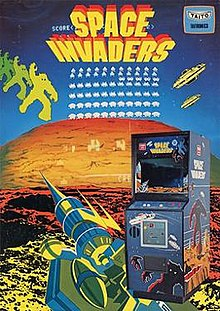

# 1 Assignment
For the assignment I need to chose 2 algorithms, train them on an environment we haven't seen before and compare them.

# 2. Evironment
### 2.1 What is Space invaders

Space invaders is a classic shoot them up arcade game from 1978 developped by Tomohiro Nishikado.  
The goal is to defeat wave after wave of descending aliens with a horizontally moving laser to earn as many points as possible without getting hit by the aliens. 

# 3 Algorithms

### 3.1 Which algorithms to compare

For this project I'll be using the Deep Q Learning algorithm and the Actor-critic algorithm.  

Orignally I wanted to compare a value based apporach with a policy based one. For my value based algorithm I opted for DQN since I thought it would preform better
than tabular Q-learning or SARSA because of the (possibly) large state space. I also find it a more intresting algorithm because of the neural network part.
I compared some policy based approaches but in the end settled on actor-critic because of the time to train (didn't have that much time for this assignment) and lack of inherit overfitting. This is not a true policy based algorithm but rather a hybrid between policy and value based so in the end I wouldn't call it a true comparison. 

The algorithms will be compared on: <ol> <li>Training time</li> <li>Episodes rewards</li> <li>Agent results</li> </ol>   

### 3.2 Deep Q learning (DQN)

Deep Q learning is a value based algorithm,  
A value based algorithm trains a value-function that outputs the value of a state or state-action pair. That value-function is then used by the policy (which is chosen in advanced) to take an action.  
Finding the optimal value-function will automatically result in finding the optimal policy.

Q-learning does this by initializing a Q-table (mappings of state-action pair & Q-value) chosing an action based on this table and updating it with the Bellman equation.  
When there are too many states/ actions or a continous state space  this approach doesn't work anymore because the Q-table becomes too large.  
This is where DQN comes into play: 
    Instead of getting the next action from the Q-table the model predicts the next action.  
    Instead of updating the Q-table we fit our model.

### 3.3 Actor-critic (AC)
Actor-critic is a hybrid between policy and value based algortihms with the actor part being policy based (it takes in a state and returns the probability of all actions) and the critic being value based (it takes in the state and the predicted value and returns a score to see how well the action fits)
